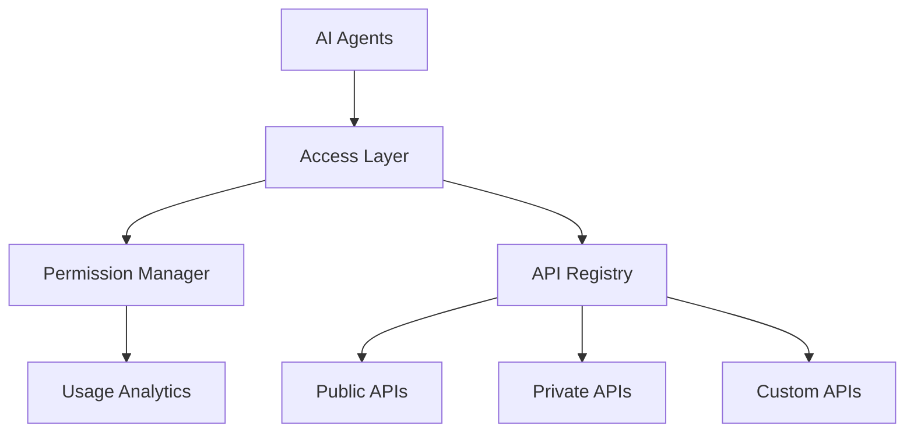

# API City - Universal API Registry & Agent Interface Platform

## Platform Overview

API City is a comprehensive API management and discovery platform designed to serve as the foundation for AI agent operations. It catalogs, organizes, and provides secure access to thousands of APIs across the internet, enabling AI agents to seamlessly interact with various services based on their requirements and permissions.

### Key Features
- **Universal API Registry**: Comprehensive database of public and private APIs
- **Standardized Interface**: Unified access patterns for all APIs
- **Permission Management**: Granular access control for agents
- **API Categories**: Organized by function, industry, and use case
- **Usage Analytics**: Track and monitor API usage patterns
- **Rate Limiting**: Smart request distribution and quota management

### Core Components
1. **API Registry Layer**
   - API documentation storage
   - Authentication methods
   - Rate limits and quotas
   - Usage patterns and statistics

2. **Agent Access Layer**
   - Agent authentication
   - Permission management
   - Request routing
   - Usage tracking

3. **Integration Layer**
   - API standardization
   - Request/response transformation
   - Error handling
   - Caching

## System Overview


## Database Schema (Supabase)

### Core Tables
```sql
-- APIs
create table apis (
  id uuid default uuid_generate_v4() primary key,
  name text not null,
  description text,
  category text[],
  base_url text,
  auth_type text,
  documentation_url text,
  swagger_spec jsonb,
  rate_limits jsonb,
  status text check (status in ('active', 'deprecated', 'beta')),
  created_at timestamp with time zone default timezone('utc'::text, now())
);

-- API Endpoints
create table endpoints (
  id uuid default uuid_generate_v4() primary key,
  api_id uuid references apis(id),
  path text not null,
  method text not null,
  description text,
  parameters jsonb,
  response_schema jsonb,
  example_response jsonb,
  created_at timestamp with time zone default timezone('utc'::text, now())
);

-- Agent Access Rights
create table agent_access (
  id uuid default uuid_generate_v4() primary key,
  agent_id uuid not null,
  api_id uuid references apis(id),
  permission_level text check (permission_level in ('read', 'write', 'admin')),
  rate_limit_override jsonb,
  created_at timestamp with time zone default timezone('utc'::text, now())
);
```

## API Categories

### Initial Category Structure
- Commerce & Payments
- Communication
- Data & Analytics
- Developer Tools
- Financial Services
- Social Media
- Content & Media
- Infrastructure
- AI & Machine Learning
- Blockchain & Crypto

## MVP Scope

### Phase 1 (MVP)
- Basic API registry
- Documentation storage
- Simple agent authentication
- Rate limiting
- Usage tracking

### Phase 2
- Advanced permission management
- API standardization layer
- Caching system
- Analytics dashboard

## Next Steps

1. Set up API registry database
2. Implement basic API documentation storage
3. Create agent authentication system
4. Build rate limiting mechanism
5. Develop usage tracking system

## Future Expansion

### Advanced Features
- AI-powered API discovery
- Automatic API documentation
- Smart rate limit optimization
- Cross-API orchestration
- Custom API creation tools

### Integration Types
- REST APIs
- GraphQL
- WebSocket
- gRPC
- Event Streams

## Technical Implementation

### Service Architecture

Each API in API City follows a uniform implementation pattern using the following tech stack:
- Railway: Individual API Service Hosting
- Supabase: Central Registry & Database
- Vercel: API Gateway & Documentation
- TypeScript: Primary Development Language

### Standard Service Structure
```
api-service/
├── src/
│   ├── index.ts        # Main entry point
│   ├── routes/         # API endpoints
│   ├── controllers/    # Business logic
│   ├── middleware/     # Auth, validation, etc.
│   └── types/         # TypeScript definitions
├── tests/
├── package.json
└── railway.toml       # Railway configuration
```

### Implementation Process

1. **Individual API Services** (Railway)
   - Standalone Express/Node.js applications
   - Each service handles one external API
   - Uniform error handling and response format
   - Individual rate limiting and caching

2. **Central Registry** (Supabase)
   - Stores API service metadata
   - Manages endpoint documentation
   - Handles service discovery
   - Tracks usage and performance

3. **API Gateway** (Vercel)
   - Single entry point for all services
   - Request routing and load balancing
   - Authentication and authorization
   - Request/response logging

4. **SDK Layer**
   - Simplified client interface
   - Automatic service discovery
   - Type-safe API calls
   - Error handling and retries

### Uniform API Response Format
```typescript
interface APIResponse<T> {
  success: boolean;
  data?: T;
  error?: {
    code: string;
    message: string;
    details?: any;
  };
  metadata: {
    timestamp: string;
    service: string;
    version: string;
  };
}
```

### Development Workflow

1. **New API Integration**
   ```mermaid
   graph TD
       A[Create Railway Service] --> B[Implement Standard Endpoints]
       B --> C[Add to Supabase Registry]
       C --> D[Update Gateway Routes]
       D --> E[Generate SDK Types]
   ```

2. **Deployment Process**
   - Railway: Automatic deployments from main branch
   - Supabase: Migration-based schema updates
   - Vercel: Automatic gateway deployments
   - SDK: NPM package releases

### MVP Phases

#### Phase 1: Core Infrastructure
- Basic Railway service template
- Supabase schema implementation
- Simple gateway routing
- Basic SDK implementation

#### Phase 2: First API Integration
- Twitter API service implementation
- Basic authentication
- Request logging
- Simple rate limiting

#### Phase 3: Scaling
- Additional API services
- Enhanced monitoring
- Advanced rate limiting
- SDK improvements

### Monitoring & Maintenance

- Railway metrics for individual services
- Supabase analytics for usage patterns
- Vercel analytics for gateway performance
- Error tracking and alerting

### Security Considerations

- API key authentication
- Rate limiting per service
- Request validation
- Data encryption
- Access logging
```

This section provides a clear roadmap for implementing each new API service while maintaining consistency across the platform. Would you like me to expand on any particular aspect of this implementation plan?